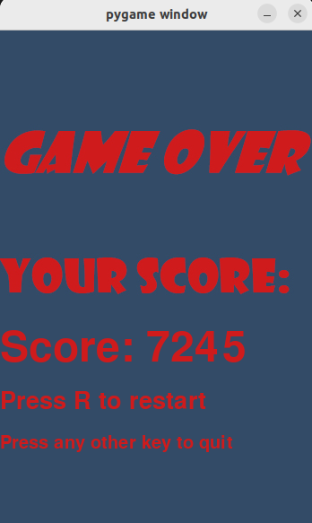

# Doodle Jump on python

## Краткое описание
Проект выполнен на python, при использовании модуля pygame.
Игра сделана на основе игры Doodle Jump, в которой игрок прыгает по блокам и старается подняться как можно выше. Всего в игре 3 вида платформ, по которым можно прыгать: обычная (чёрная), подвижная (коричневая) и разламывающаяся (серая), по которой нельзя прыгать и при соприкосновении с которой игрок не отталкивается, а просто падает сквозь неё. На некоторых платформах может находится батут или пружинка: если прыгнуть на них, то игрок вылетит вверх с большей силой и соотвественно сможет преодолеть большее расстояние вверх.

Герой умирает при соприкосновении с нижней частью экрана, то есть когда упал слишком низко и ни от чего не успел отталкнуться.

Также, по пути героя могут встречаться монстры, которых можно убить шариком энергии, который выпускает герой. При соприкосновении с монстром герой автоматически и безвозвратно умирает, а игра завершается.


## Описание управления

Модельку игрока можно двигать вправо и влево с помощью соответствующих стрелочек на клавиатуре. ГГ стреляет строго вверх при нажатии пробела; с помощью выпускаемых снарядов можно поразить монстра, чтобы он Вас не убил. Закрыть игру можно, нажав escape.

### Примечание 
Весь процесс игры сопроваждается звуками, иногда даже громкими, поэтому не забываем включать звук!

Плюс во время игры вычисляется счёт (чем выше допрыгал, тем он больше), который будет выводится на итогов экране.



## Установка и начало игры

Установка игры:
```
git clone git@github.com:VileHero-Alex/PythonProject2023.git
pip3 install -r requirements.txt
```

Запуск игры:
```
python3 run_game.py
```
